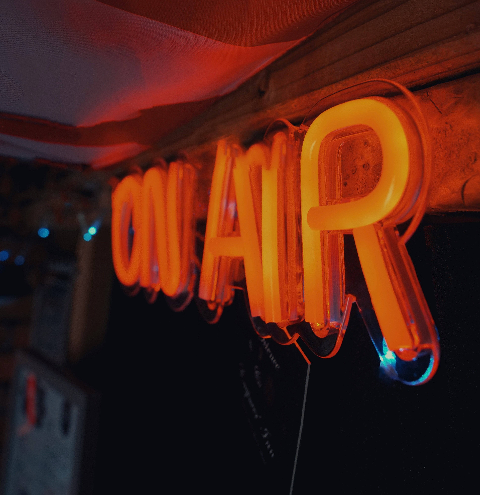
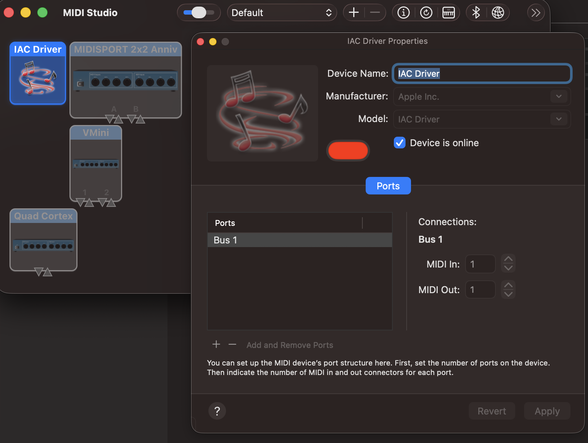
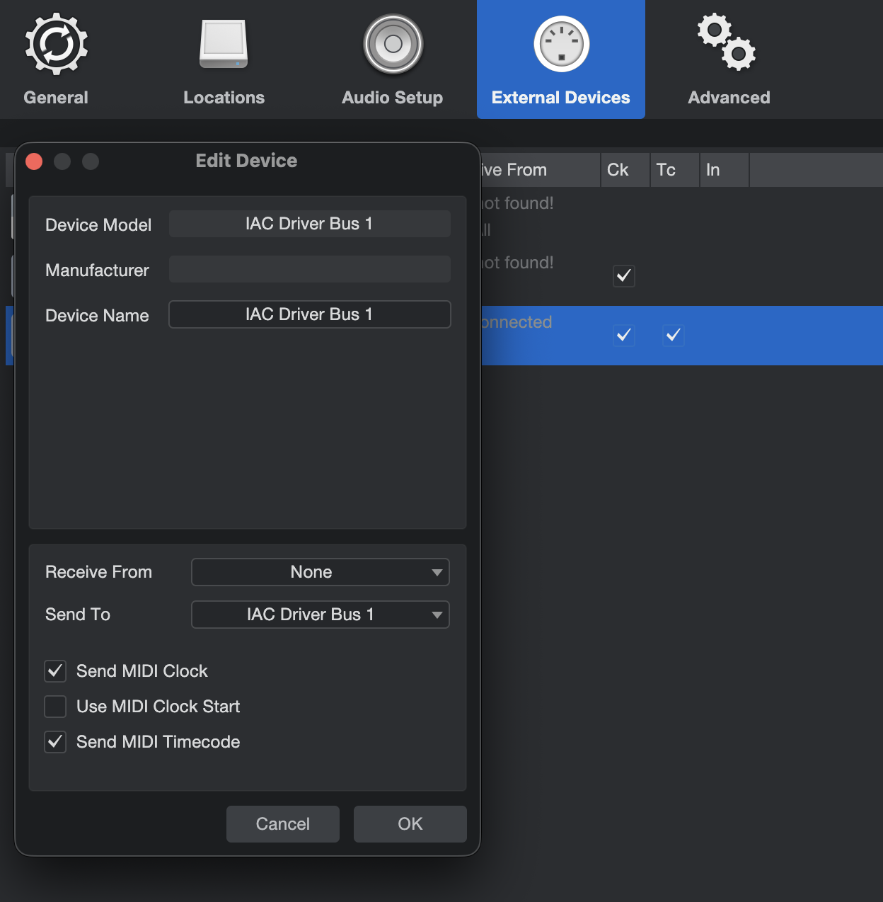

# redlight


MIDI-driven IoT trigger for musicians with active recording detection, written in Rust.

[Checkout the demo here](https://www.youtube.com/shorts/SL_OzyB37BE)


**What is redlight?**

Have you ever seen these cool red "On-Air" lights in recording studios, that light up when someone is recording?

Well you can have that too!

redlight is a MIDI-driven and record-aware bridge application, that listens to your DAW's signals and lets you trigger IoT devices (such as a red light) when you are recording or playing back.

Once you hit play or record, your configured triggers will be activated, and when you stop, they will be deactivated.

> Note: `redlight` only checks your input signal to detect if there is any active recording. No audio data is stored or transmitted anywhere.

> :warning: Currently, redlight is only compatible with MacOS.


## Supported Triggers
- [x] Homebridge Switches

> redlight is in very early stages of development and currently lacks broad support for other IoT devices / ecosystems. If you have any suggestions or want to contribute, feel free to open an issue or a pull request!


## Usage

To use redlight, you need to setup your MIDI environment, configure your DAW to send MIDI signals to the IAC Driver and connect redlight to the IAC driver, your audio input device and your IoT devices.

### MIDI setup

Open the MIDI Setup on your Mac and make sure the IAC Driver is enabled and has Bus 1 configured.



### DAW setup

In your DAW, add the IAC Driver as MIDI input device and enable MIDI clock and transport signals to be sent to the IAC Driver. The exact steps to do this will depend on your DAW, but it usually involves going into the MIDI settings and enabling the appropriate options for the IAC Driver.

#### Fender Studio Pro

In Fender Studio Pro, you can enable MIDI clock and transport signals by going to `Preferences > External Devices`. Add a new control surface device, select `Send To -> IAC Driver Bus 1`, give it a proper name and check the boxes
- [x] Send MIDI Clock
- [x] Send MIDI Timecode



### redlight setup

1. Clone the repository and build the application using Cargo.
2. Add a `config.yml` file in the same directory and configure your audio devices and triggers.

```yaml
iot:
  homebridge:
    # Homebridge Config UI X API URL
    api_url: "http://localhost:8581/api"
    device:
      # the uniqueId property of the Homebridge device you want to trigger.
      unique_id: 45fee1...
      # can also be extracted from the homebridge accessory properties
      characteristic_type: "On"
devices:
  # you can declare any of your audio devices here and reference the desired one below audio.microphone
  - &mac "MacBook Pro Microphone"
  - &quantum "Quantum LT2"
audio:
  microphone: *mac
```
3. Run `redlight` using `cargo run` and allow the application to use your microphone when prompted.
4. Hit record and start singing / playing your instrument. You should see the configured triggers being activated!


## Tested DAWs
- [x] Fender Studio Pro
- [x] Logic Pro X
- [ ] GarageBand
- [ ] Ableton Live
- [ ] Pro Tools
- [ ] Cubase
- [ ] Reaper
- [ ] FL Studio


> On Air Photo by <a href="https://unsplash.com/@alfinimages?utm_source=unsplash&utm_medium=referral&utm_content=creditCopyText">Alan Findlay</a> on <a href="https://unsplash.com/photos/a-neon-sign-hanging-from-the-side-of-a-wall-qKEQBAKbXhw?utm_source=unsplash&utm_medium=referral&utm_content=creditCopyText">Unsplash</a>
